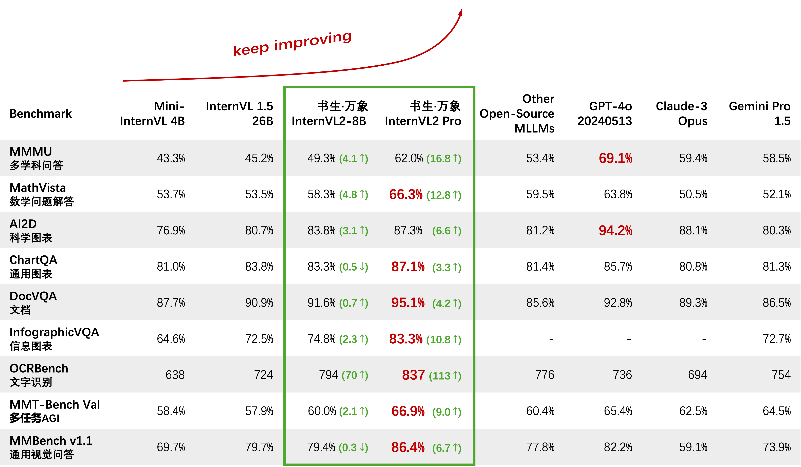
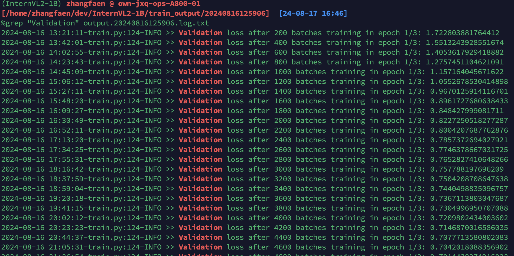
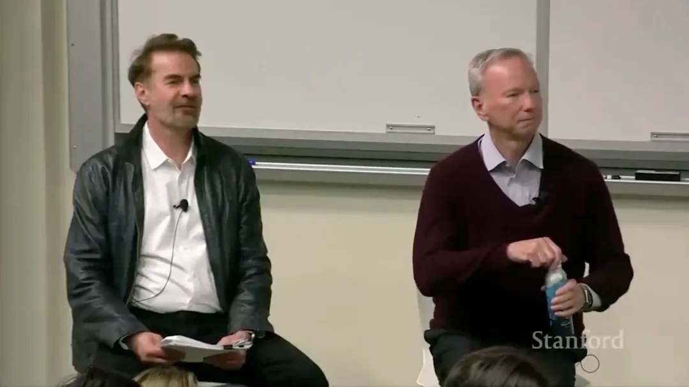
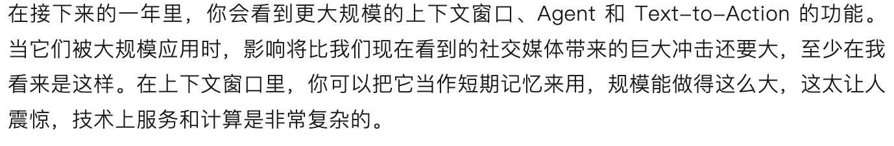

# Fine-tuning InternVL2

2024年7月，InternVL团队发布了2.0版本的视觉语言大模型VLM，中文正式名称为"书生·万象”。它是目前已知性能最强的开源多模态大模型(见数值对比表），也是国内首个在MMMU（多学科问答）上突破60的模型。数学基准MathVista的测试中、书生·万象的得分为66.3%，显著高于其他闭源商业模型和开源模型。  


InternVL开放了多个不同参数规模的模型权重，例如40B，8B, 2B, 1B参数规模的模型权重。 详细见 https://huggingface.co/collections/OpenGVLab/internvl-20-667d3961ab5eb12c7ed1463e   

今年7月10号在微信公众号“后向传播”上，我写过一篇文章《视觉语言大模型VLM可能比语言大模型LLM更有颠覆性 | 如何微调火热的Florence-2 VLM | VLM可以驱动机器人》，链接：https://mp.weixin.qq.com/s/JnBX41Yrl1LlscmqJU3vkA   
那篇文章中，我专门写了代码微调（Finetune）或者再训练（Continue Pretrain) 微软的Florence-2 VLM。

既然InternVL2.0是目前开源最强的VLM，那我们当然要继续微调InternVL2.0，让它有新的能力或者增强某方面的能力。

InternVL官方团队已经给出了微调的代码，见https://github.com/OpenGVLab/InternVL/tree/main/internvl_chat/shell/internvl2.0/2nd_finetune . 
不过，官方的代码使用了transformers trainer, torchrun, deepspeed等高等级库，这些工具把大量核心概念封装起来，方便了产品级开发使用，但对于想学习了解“微调或者再训练一个VLM”的同学，不太友好， 因为：容易知其然，但不知其所以然。

因此，我决定重写一份简化版的微调代码，微调或者再训练InternVL2 1B模型。  
代码在GitHub上： https://github.com/zhangfaen/finetune-InternVL2 ，感兴趣的同学，可以继续follow后面的内容。

### 快速开始微调或者再训练InternVL2 1B模型

```bash
%git clone https://github.com/zhangfaen/finetune-InternVL2
%cd finetune-InternVL2
%conda create --name InternVL2-1B python=3.10
%conda activate InternVL2-1B
%pip install -r requirements.txt
%pip install 'huggingface_hub[cli,torch]'
%huggingface-cli download zhangfaen/InternVL2-1B-checkpoint model.safetensors --local-dir model/
%export CUDA_VISIBLE_DEVICES=3  # suppose your available GPU card is the 3rd
%python train.py
```

在train.py文件中，我仍然使用https://huggingface.co/datasets/zhangfaen/DocumentVQA数据集来微调或者再训练InternVL2 1B模型。
由于GPU（我使用的是NVIDIA A800 80G显存）显存有限，训练时，我使用了一些常见的优化技巧，例如：  
- 使用gradient accumulation技术，8个batch后，做一次参数更新
- 冻结一部分参数，不参与学习（主要是冻结模型中的image encoder部分和language model部分）  

上面的一些技巧，我不用各种现成的库去实现，而是用最原始的python/pytorch代码实现。其实一些技巧的原理并不复杂，例如gradient accumulation，可以用下面的几行代码示例（具体见本repo下面的train.py文件）：  
```python
optimizer = ...
NUM_ACCUMULATION_STEPS = ...
for epoch in range(...):
    for idx, sample in enumerate(dataloader):
        inputs, labels = sample

	    # Forward Pass
        outputs = model(inputs)
        # Compute Loss and Perform Back-propagation
	    loss = loss_fn(outputs, labels)

	    # Normalize the Gradients
	    loss = loss / NUM_ACCUMULATION_STEPS
        loss.backward()

	if ((idx + 1) % NUM_ACCUMULATION_STEPS == 0) or (idx + 1 == len(dataloader)):
		# Update Optimizer
        optimizer.step()
		optimizer.zero_grad()
```

### 微调或者再训练InternVL2 1B模型的validation loss

可以看到，Validation loss在微调或者再训练过程中，逐渐下降，说明模型在数据集上表现越来越好。  
不过这里也想强调一下，这篇文章和本repo更多的是一个教学性质，微调或者再训练后的模型，没有进行严格的性能测试，这部分工作，感兴趣的同学可以继续。  

另外，我最近写了两篇关于VLM的微调或者再训练的文章和代码，主要是因为VLM本质上和驱动机器人的大模型VLA（vision language action model for text-to-action）技术有很多相似之处，VLA部分工作目前还不方便写到公开的文章中，因此分享一些VLM的微调或者再训练的代码，希望对大家有帮助。  

今天有一篇文章在朋友圈传播， 《在这段被下架的视频里，谷歌前CEO说了很多真话》，其中有一段话，和我上面说的VLA很契合 text-to-action 会变的非常重要：



## Acknowledgement
This repo is built based on 
- https://huggingface.co/datasets/zhangfaen/DocumentVQA
- https://huggingface.co/zhangfaen/InternVL2-1B-checkpoint 
- https://huggingface.co/OpenGVLab/InternVL2-1B/    

Many thanks to them for the great model/data/code!

